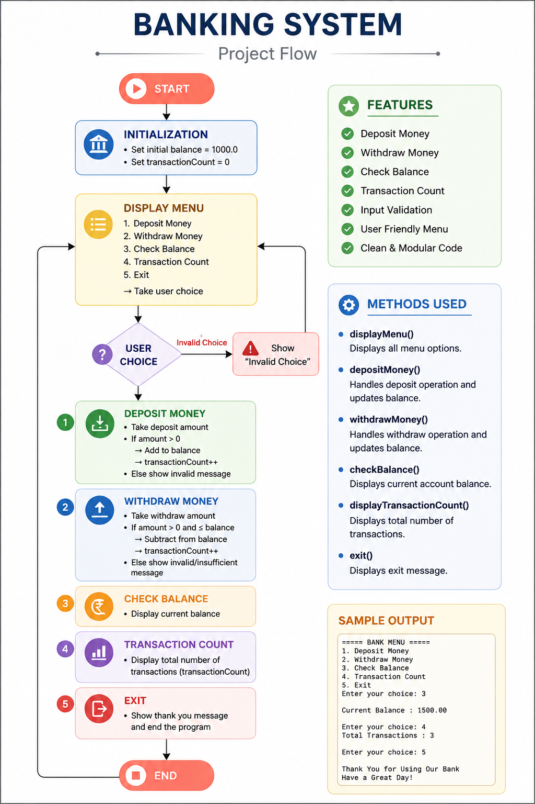

# 🏦 Banking System (Core Java)

A console-based Banking System developed using Core Java. This project demonstrates modular programming, methods, loops, switch-case, input validation, and transaction management.

## 📊 Project Flow



## 📌 Features

✅ Deposit Money

✅ Withdraw Money

✅ Check Balance

✅ Transaction Counter

✅ Input Validation

✅ Menu-Driven Program

## 🛠 Technologies Used

- Java
- Scanner Class
- Methods
- Switch Case
- do-while Loop
- if-else Statements

## 📚 Core Java Concepts Covered

- Variables
- Methods
- Parameters & Return Types
- Conditional Statements
- Loops
- Scanner
- Modular Programming
- Static Variables

## ▶ Sample Menu

```
===== BANK MENU =====
1. Deposit Money
2. Withdraw Money
3. Check Balance
4. Transaction Count
5. Exit
```

## 👨‍💻 Author

**Arjun Das**

- Java Beginner Projects
- BCA Student
